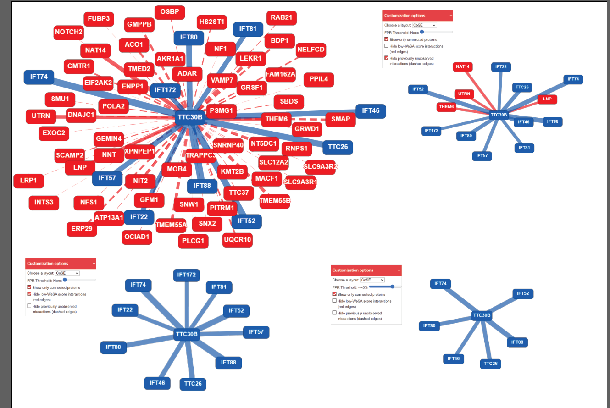

Tool for improving affinity proteomics data.

## Description
WeSA (weighted socioaffinity) is a novel statistical score which can be used to rank proteomics experiments results of the bait-prey type (e.g. affinity purification, immunoprecipitation or proximity labelling) and help distinguishing true protein-protein interactions from the noise. 

We have implemented WeSA as a web application that can be used to rank and filter any list of protein-protein interactions. 
WeSA is freely available and open to all users without login requirement at [wesa.russelllab.org](wesa.russelllab.org).

Results are presented in an interactive network that allows the user to filter out the low ranked interactions, 
as well as in a table that contains all interacting protein pairs together with their WeSA score and which can be downloaded for further analysis.



## Evaluation
ROC analysis (using CORUM-PDB positives and Negatome negatives) shows that WeSA improves 
over other measures of interaction confidence. WeSA shows consistently good results over 
all datasets (up to: AUC = 0.93 and at best threshold: TPR = 0.84, FPR = 0.11, 
Precision = 0.98).


## Setup & Configuration

### Requirements
WeSA requires Python3.6 or higher. We recommend using a virtual environment to install the required packages, e.g.:
```shell
source my_env/bin/activate
pip install -r wesa/requirements.txt
```

### Data
All data files required for WeSA can be downloaded at [russelllab.org/wesa/data/](russelllab.org/wesa/data/).

Edit `wesa_app/.env` file to point to the correct data files location. 


## Use
WeSA is provided as a Flask app that allows the same functionalities as our online version.

In addition, WeSA can be run via command line interface, directly generating the network and table output files.
```shell
python run.py -i <input_file> -d <database> -o <output_dir>
```
